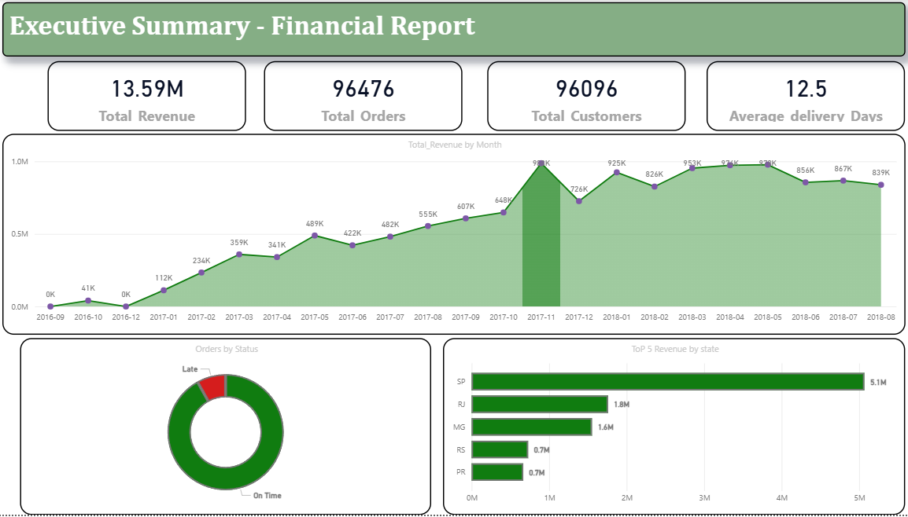
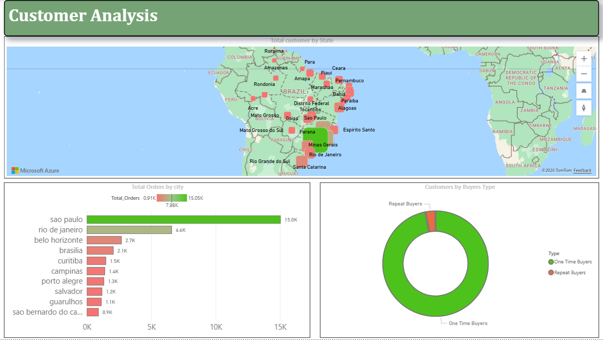
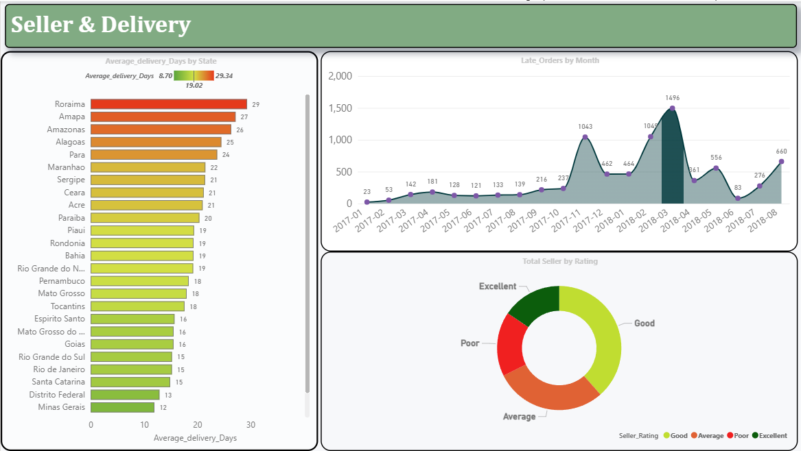

<div align="center">

# 🛒 Brazilian E-Commerce Analysis
## Olist Dataset — End to End Data Analysis Project


</div>

---

## 📌 Project Overview

This is a complete end-to-end data analysis project based on the **Olist Brazilian E-Commerce Public Dataset**. The project follows the full data analyst workflow — from raw data loading and cleaning to SQL business analysis and interactive Power BI dashboards.

> **Olist** is the largest department store in Brazilian marketplaces. This dataset contains information on 100,000+ orders made between 2016 and 2018 across multiple marketplaces in Brazil.

---

## 🎯 Business Questions Answered

| # | Business Question |
|---|---|
| 1 | What is the total revenue and growth trend over time? |
| 2 | Which states and cities generate the most orders? |
| 3 | Are orders being delivered on time? |
| 4 | What percentage of customers are repeat buyers? |
| 5 | Which sellers are most and least efficient? |
| 6 | How does freight cost impact business performance? |
| 7 | What is the average order value? |
| 8 | Which hours and days have peak order activity? |

---

## 🗂️ Dataset

**Source:** [Olist Brazilian E-Commerce Dataset — Kaggle](https://www.kaggle.com/datasets/olistbr/brazilian-ecommerce)

### Files Used:
| File | Description | Rows |
|---|---|---|
| olist_customers_dataset.csv | Customer information | 99,441 |
| olist_orders_dataset.csv | Order details and timestamps | 99,441 |
| olist_order_items_dataset.csv | Items within each order | 112,650 |
| olist_order_payments_dataset.csv | Payment information | 103,886 |
| olist_order_reviews_dataset.csv | Customer reviews | 99,224 |
| olist_products_dataset.csv | Product details | 32,951 |
| olist_sellers_dataset.csv | Seller information | 3,095 |
| olist_geolocation_dataset.csv | Zip code coordinates | 1,000,163 |
| product_category_name_translation.csv | Category name translations | 71 |

---

## 🛠️ Tools & Technologies

| Tool | Purpose |
|---|---|
| 🐍 Python (Pandas) | Data loading, cleaning, EDA |
| 📓 Jupyter Notebook | Exploratory analysis environment |
| 🗄️ SQL Server (SSMS) | Business analysis queries |
| 📊 Power BI | Interactive dashboard and visualization |
| 🐙 GitHub | Version control and project documentation |

---

## 📁 Project Structure

```
Olist-Ecommerce-Analysis/
│
├── 📂 data/
│   ├── raw/                          # Original CSV files from Kaggle
│   └── cleaned/                      # Cleaned and processed CSV files
│       ├── customers_cleaned.csv
│       ├── orders_cleaned.csv
│       └── order_items_cleaned.csv
│
├── 📂 notebooks/
│   └── Data_Cleaning.ipynb           # Python EDA and data cleaning
│
├── 📂 sql/
│   ├── 01_sales_revenue.sql          # Sales and revenue analysis
│   ├── 02_customer_geography.sql     # Customer and geography analysis
│   ├── 03_delivery_performance.sql   # Delivery performance analysis
│   ├── 04_order_behaviour.sql        # Order behavior analysis
│   └── 05_freight_shipping.sql       # Freight and shipping analysis
│
├── 📂 images/
│   ├── page1_executive_summary.png   # Dashboard Page 1 screenshot
│   ├── page2_customer_analysis.png   # Dashboard Page 2 screenshot
│   └── page3_seller_delivery.png     # Dashboard Page 3 screenshot
│
└── README.md                         # Project documentation
```

---

## 🔄 Project Workflow

```
Raw Data → EDA → Cleaning → SQL Analysis → Power BI Dashboard → Insights
```

### Step 1 — Data Loading (Python)
- Loaded 3 core CSV files using Pandas
- Verified dataset shapes and column structures
- Customers: 99,441 rows × 5 columns
- Orders: 99,441 rows × 8 columns
- Order Items: 112,650 rows × 7 columns

### Step 2 — Exploratory Data Analysis (Python)
- Checked data types, missing values, and duplicates
- Found missing values in 3 date columns in Orders table
- Zero duplicate rows across all 3 datasets
- Identified date columns stored as strings — needed conversion

### Step 3 — Data Cleaning (Python + SQL)
- Converted 5 date columns from string to datetime64 format
- Filled missing date values using average time difference method
- Filtered to delivered orders only — retained 96,476 clean records
- Exported cleaned files as CSV for SQL import

### Step 4 — Business Analysis (SQL Server)
- Wrote 20+ analytical queries across 5 business problem areas
- Techniques used: CTEs, Window Functions, JOINs, CASE WHEN, LAG(), DATEDIFF()

### Step 5 — Visualization (Power BI)
- Built 3-page interactive dashboard
- Created DAX measures for KPIs, ratings, and delivery metrics
- Connected 3 tables through data model relationships
- Added Azure Map visual for geographic customer distribution

---

## 📊 Power BI Dashboard

### 🔹 Page 1 — Executive Summary — Financial Report

[](images/page1_executive_summary.png)

| Visual | Business Insight |
|---|---|
| KPI Cards | R$13.59M revenue · 96,476 orders · 96,096 customers · 12.5 days avg delivery |
| Revenue Trend Line | Business grew 10x from R$112K (Jan 2017) to R$988K (Nov 2017) |
| On Time vs Late Donut | 91.89% delivered on time · 8.11% late deliveries |
| Top 5 States Bar Chart | SP dominates with R$5.1M — nearly 3x second place RJ |

---

### 🔹 Page 2 — Customer Analysis

[](images/page2_customer_analysis.png)

| Visual | Business Insight |
|---|---|
| Brazil State Map | Heavy customer concentration in Southeast Brazil |
| Top 10 Cities Bar Chart | Sao Paulo = 15K orders — more than double Rio de Janeiro |
| Buyers Type Donut | 96.88% one time buyers — critical retention problem identified |
| Peak Order Hours | Afternoon (1pm-6pm) drives majority of daily orders |

---

### 🔹 Page 3 — Seller & Delivery Deep Dive

[](images/page3_seller_delivery.png)

| Visual | Business Insight |
|---|---|
| Delivery Days by State | Roraima worst at 29 days · Minas Gerais best at 12 days |
| Late Orders Trend | Late orders peaked at 1,496 in March 2018 |
| Top 10 Sellers Revenue | Revenue heavily concentrated in top sellers |
| Seller Rating Donut | Mix of Good/Average/Poor sellers — optimization needed |

---

## 🔍 Key SQL Queries

### 💰 Average Order Value:
```sql
WITH AVG_Order_Value AS (
    SELECT order_id, SUM(price) AS revenue
    FROM order_items
    GROUP BY order_id
)
SELECT AVG(revenue) AS avg_order_value
FROM AVG_Order_Value
```

### 📈 Month Over Month Revenue Growth:
```sql
WITH Monthly_Revenue AS (
    SELECT
        YEAR(o.order_purchase_timestamp) AS year,
        MONTH(o.order_purchase_timestamp) AS month,
        SUM(price) AS revenue
    FROM orders o
    JOIN order_items oi ON o.order_id = oi.order_id
    GROUP BY YEAR(o.order_purchase_timestamp), MONTH(o.order_purchase_timestamp)
)
SELECT
    year, month, revenue,
    LAG(revenue, 1) OVER (ORDER BY year, month) AS prev_revenue,
    ROUND(((revenue - LAG(revenue,1) OVER (ORDER BY year,month)) /
    LAG(revenue,1) OVER (ORDER BY year,month)) * 100, 2) AS growth_percentage
FROM Monthly_Revenue
ORDER BY year, month
```

### 🚚 Late vs On Time Delivery:
```sql
SELECT
    CASE WHEN order_delivered_customer_date > order_estimated_delivery_date
         THEN 'Late' ELSE 'On Time'
    END AS delivery_status,
    COUNT(order_id) AS total_orders
FROM orders
WHERE order_delivered_customer_date IS NOT NULL
GROUP BY CASE WHEN order_delivered_customer_date > order_estimated_delivery_date
              THEN 'Late' ELSE 'On Time' END
```

### ⭐ Seller Rating by Freight Efficiency:
```sql
SELECT
    seller_id,
    COUNT(order_id) AS total_orders,
    ROUND(AVG(price), 2) AS avg_price,
    ROUND(AVG(freight_value), 2) AS avg_freight,
    ROUND(AVG(freight_value/price)*100, 2) AS freight_percentage,
    CASE WHEN AVG(freight_value/price)*100 < 10 THEN 'Excellent'
         WHEN AVG(freight_value/price)*100 < 25 THEN 'Good'
         WHEN AVG(freight_value/price)*100 < 50 THEN 'Average'
         ELSE 'Poor'
    END AS seller_rating
FROM order_items
WHERE price != 0 AND price IS NOT NULL
GROUP BY seller_id
ORDER BY freight_percentage ASC
```

---

## 💡 Key Business Insights

### 1️⃣ Revenue & Growth
- Total revenue of **R$13.59M** generated across 2 years
- Business grew **10x** from R$112K (Jan 2017) to R$988K (Nov 2017)
- Revenue stabilized consistently at **R$800K-R$978K** throughout 2018

### 2️⃣ Geography
- **Sao Paulo** alone accounts for **R$5.1M** — nearly 3x second place Rio de Janeiro
- Top 3 revenue cities (SP, RJ, BH) are all concentrated in **Southeast Brazil**
- Northern states have minimal customer presence — **untapped market opportunity**

### 3️⃣ Customer Retention
- **96.88% of customers never place a second order** — critical retention problem
- Only **3.12% are repeat buyers** — loyalty program urgently needed
- Business is spending heavily on acquisition with very low lifetime value

### 4️⃣ Delivery Performance
- **8.11% of orders are delivered late** — 1 in every 12 customers affected
- **Roraima** worst performer at **29 days** average delivery
- **Minas Gerais** best performer at **12 days** average delivery
- Gap of **17 days** between best and worst performing states

### 5️⃣ Seller Efficiency
- Revenue is heavily concentrated in **top 10 sellers** — dependency risk
- Poor rated sellers charge freight costs **50%+ of item price**
- Excellent sellers maintain freight below **10% of item price**

---

## 📋 Business Recommendations

| # | Problem Identified | Recommendation |
|---|---|---|
| 1 | 96.88% one time buyers | Launch customer loyalty and rewards program |
| 2 | Northern states 25+ day delivery | Partner with regional logistics providers |
| 3 | Revenue concentrated in SP only | Expand targeted marketing to MG, RS, PR states |
| 4 | Poor seller high freight costs | Enforce maximum freight percentage policy |
| 5 | Late delivery spikes in peak months | Build buffer logistics capacity for high volume periods |
| 6 | Top seller revenue dependency | Onboard and develop mid-tier sellers |

---

## 🚀 How to Run This Project

### Python Setup:
```bash
pip install pandas openpyxl jupyter
cd "D:\DA Projects\Olist_Dataset"
jupyter notebook
```
Open `Data_Cleaning.ipynb` and run all cells top to bottom

### SQL Setup:
```sql
-- Step 1: Create Database
CREATE DATABASE OlistDB;

-- Step 2: Import cleaned CSV files via SSMS
-- Tasks → Import Flat File → select CSV files

-- Step 3: Run SQL files in order
-- 01_sales_revenue.sql
-- 02_customer_geography.sql
-- 03_delivery_performance.sql
-- 04_order_behaviour.sql
-- 05_freight_shipping.sql
```

### Power BI Setup:
```
1. Install Power BI Desktop
2. Open Power BI → Get Data → Text/CSV
3. Load all 3 cleaned CSV files
4. Verify relationships in Model View
5. Build visuals as per dashboard screenshots
```

---

## 👤 Author

**Prit Patel**
- 🎯 Aspiring Data Analyst
- 🛠️ Skills: Python · SQL · Power BI · Excel
- 📧 Connect on LinkedIn

---

## 📄 License

This project uses publicly available data from Kaggle.
Dataset is licensed under **CC BY-NC-SA 4.0**

---

<div align="center">

⭐ If you found this project helpful, please give it a star!

</div>
